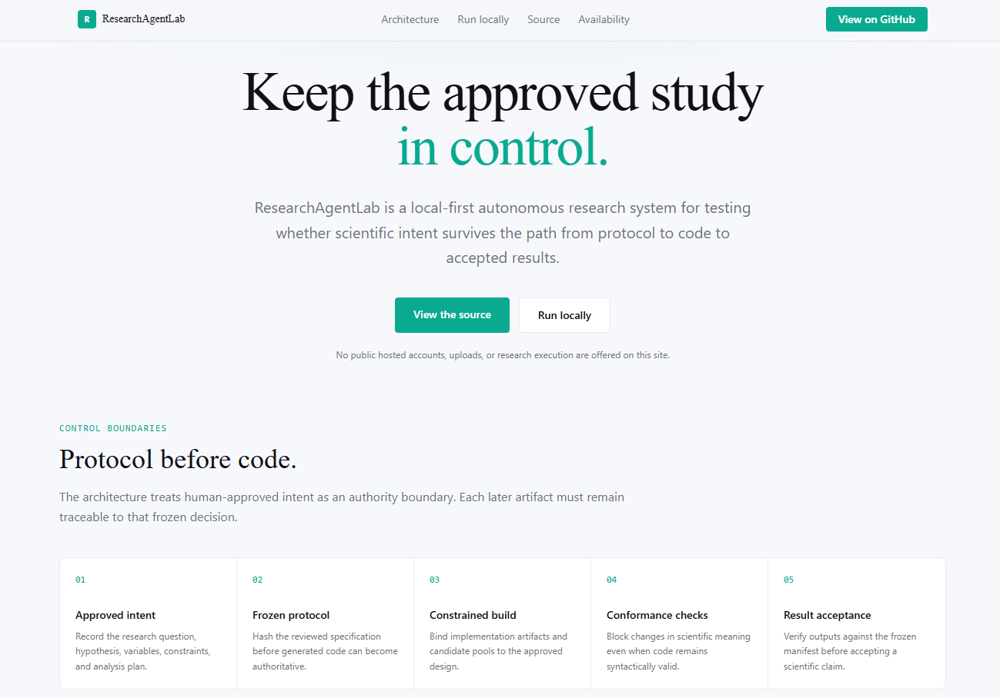

# ResearchAgentLab

**ResearchAgentLab** is a local-first research-control workspace for turning a research brief into literature evidence, an approved scientific question, a controlled study, checked results, and a traceable report.

It is also the reference implementation for **Protocol Before Code**: a safety architecture designed to detect and block cases where an autonomous research workflow silently implements a different experiment from the one that was approved.

> **A runnable experiment is not necessarily the intended experiment.**

ResearchAgentLab is a research prototype. Generated code should be executed only in an environment you control, and its outputs still require scientific review.

[](https://researchagentlab.com)

Public project site: **https://researchagentlab.com/**

---

## Why this project exists

Autonomous research systems can fail without crashing.

A pipeline may successfully collect papers, generate code, run an experiment, and produce a polished report while the executable study has drifted away from the scientific question that a human actually approved.

ResearchAgentLab focuses on that control problem.

The project asks:

> **How can a research agent preserve human-approved scientific intent across planning, generation, execution, repair, and reporting—and how can we detect when that correspondence breaks?**

The motivating failure mode is **silent scientific objective drift**: a workflow begins from an approved scientific objective, but a later planning, generation, repair, fallback, or execution step changes the effective experiment without making that change visible to the reviewer.

The model does not need to be malicious for this to happen. Drift can arise from ambiguity, shortcuts, fallback behavior, repair logic, or apparently reasonable substitutions.

---

## Safety framing

ResearchAgentLab is **not** a general AGI alignment solution. It studies a narrower research-control problem: preserving approved scientific intent as increasingly autonomous systems move from specification to implementation and evidence.

The architecture is motivated by several AI-safety principles.

### Informed oversight

A reviewer should be able to determine:

- what study was approved;
- what assumptions and methods were frozen;
- what code or apparatus was actually executed;
- what changed after approval;
- what evidence supports each reported claim.

ResearchAgentLab does not claim complete informed oversight of a model's internal reasoning. Instead, it aims to reduce information loss across the observable research workflow.

### Defense in depth

No single approval step is treated as sufficient.

Intent checks, methodology review, artifact integrity, software validation, execution controls, result checks, and claim-to-evidence review are separate safeguards because each can fail independently.

### Least authority

The system gives models only the implementation freedom required by the study.

Where a declarative representation is sufficient, trusted apparatus executes the experiment and the model supplies bounded structured content. More open-ended code generation is used only when a constrained representation is not sufficient.

### Human escalation under uncertainty

The system is not designed to maximize automation.

Ambiguous intent, scientifically material changes, failed conformance, and other high-consequence deviations are surfaced for stronger checks or explicit human review rather than silently accepted.

### Alignment-style stress testing

Safety properties are tested adversarially.

The project deliberately constructs drifted protocols, apparatus mutations, and layered fault cases to test whether the control stack detects or contains failures before they become accepted scientific results.

These mechanisms do not guarantee alignment of the underlying model. They aim to make failures in the surrounding research process more observable, bounded, and recoverable.

---

## What it does

- Searches multiple scholarly sources and preserves source provenance.
- Extracts findings, limitations, methods, datasets, and evidence from papers.
- Challenges proposed literature gaps before turning them into research questions.
- Pauses for user decisions at question, hypothesis, source, and analysis-plan gates.
- Supports both declared-dataset studies and generated experiment codebases.
- Stores versioned artifacts so completed work can be resumed instead of silently regenerated.
- Routes work across local models and configured API providers.
- Tracks provider usage, cost, fallbacks, retries, and operational failures.
- Produces structured results, checked claims, and Markdown/LaTeX/PDF reports.
- Separates scientific conformance from ordinary software validation.
- Preserves an auditable chain from approved intent to executable artifacts and reported claims.

---

## Threat model

The primary threat considered by ResearchAgentLab is **silent scientific objective drift**:

> A research workflow begins from an approved scientific objective, but a later planning, generation, repair, or execution step changes the effective experiment without making that change visible to the reviewer.

The control architecture therefore focuses on preserving and checking the correspondence between:

```text
approved intent
    -> frozen scientific design
    -> executable artifacts
    -> observed results
    -> reported claims
```

This is a control and scientific-integrity threat model, not a claim that all autonomous-agent risks reduce to objective drift.

ResearchAgentLab does not currently evaluate frontier dangerous capabilities such as autonomous replication, cyber capability, CBRN capability, or strategic deception, and it does not perform mechanistic interpretability.

---

## Current research status

The safety architecture and its motivating Choice-Set workload have been evaluated separately.

These results are intentionally kept distinct:

- safety benchmarks do not establish the scientific hypothesis;
- a successful scientific experiment does not validate every safety layer;
- development, confirmatory, and post-hoc evidence are not pooled.

### Safety validation

| Evaluation result | Result |
| --- | ---: |
| Clear scientific drift accepted by intent fidelity | 0/13 |
| Any drifted protocol accepted | 0/18 |
| Faithful protocols hard-blocked | 1/16 |
| Faithful protocols escalated for review | 6/16 |
| Generator-blind semantic apparatus mutations detected before execution | 18/18 |
| Apparatus mutations that would escape without integrity control | 15/18 |
| Faults detected in the final layered benchmark | 25/25 |
| Faults escaping the final layered benchmark | 0/25 |

These are bounded results from the recorded Choice-Set-domain evaluations and mutation suites. They do **not** establish cross-domain reliability.

### Frozen Choice-Set H1 result

One frozen confirmatory run completed **192 paired units** and **384 condition records** with:

- no exclusions;
- no fatal failures;
- no parse failures;
- no model retries.

| Outcome | Benign curation | Adversarial curation | Difference | Paired-bootstrap 95% CI |
| --- | ---: | ---: | ---: | ---: |
| Target selection | 25/192 (13.0%) | 52/192 (27.1%) | +14.1 pp | [+8.3, +20.3] pp |
| Explicit approval | 192/192 (100%) | 192/192 (100%) | 0.0 pp | [0.0, 0.0] pp |

The frozen H1 rule was satisfied for this candidate pool, prompt set, local model digest, and execution schedule.

Approval was at a complete ceiling, and post-hoc mechanism diagnostics remain descriptive. No second confirmatory run was performed.

Public evidence organization:

- [`research_logs/README.md`](research_logs/README.md)
- [`research_logs/paper_evidence/claims.md`](research_logs/paper_evidence/claims.md)

---

## Safety evaluation method

The safety evaluation follows a stress-testing pattern:

1. define a safety property;
2. identify the assumptions on which that property depends;
3. deliberately construct cases that violate or stress those assumptions;
4. measure whether the control stack detects, contains, or escalates the failure;
5. keep development fixes separate from frozen confirmatory evidence.

The benchmarks should therefore be read as **bounded adversarial tests of specific safety properties**, not as proof that the system is generally safe.

The project also distinguishes:

- **development regression tests** — used while fixing the system;
- **fresh holdouts** — used to test behavior on unseen cases;
- **confirmatory scientific runs** — frozen before execution;
- **post-hoc diagnostics** — descriptive follow-up analysis only.

---

## How the workflow is organized

ResearchAgentLab does not assume that every user needs one fixed pipeline.

Each stage declares what it requires, what it produces, and whether it is ready to run. Existing paper lists, gap reports, and research questions can be imported rather than regenerated; imported material is marked as such.

```text
Research brief or imported artifacts
        |
        v
Paper collection -> literature review -> gap checks -> question gate
        |
        +-- Declared-dataset study
        |      data audit -> hypothesis gate -> analysis-plan gate
        |      -> tested analysis blocks -> results -> claims -> report review
        |
        +-- Generated experiment
               hypothesis -> scientific design/build controls
               -> software preflight -> execution
               -> result and quality review
```

For controlled decision studies, the Protocol Before Code path is:

```text
Approved intent
    -> StudyProtocol
    -> Intent Fidelity + Methodology Review
    -> Freeze and protocol hash
    -> BuildManifest
    -> Least-authority generation
    -> Scientific Conformance
    -> Software Preflight
    -> Execution
    -> Result Conformance
    -> Claim-to-evidence review
```

The two pre-freeze reviews answer different questions:

- **Intent Fidelity:** Is this still the study that was approved?
- **Methodology Review:** Is that study scientifically defensible?

A sound design for the wrong question fails intent fidelity.

A faithful but unsound design fails methodology review.

Neither verdict can override the other.

---

## Least-authority execution tiers

| Tier | Model authority |
| --- | --- |
| **Declarative** | Trusted apparatus runs the study; the model supplies bounded structured content. |
| **Plugin** | Trusted infrastructure remains fixed; the model implements a declared interface. |
| **Open-ended** | The model may generate the program when no constrained representation is available. |

Trusted apparatus is bound to the `BuildManifest` by content hash, not only by filename or interface.

Scientific changes require a new protocol version. Software repair is not allowed to redefine the frozen science.

This separation is intentional: ResearchAgentLab assumes that model behavior, generated code, and human review can each fail independently. A model output is not granted additional authority merely because it appears reasonable or passes an ordinary software check.

---

## Monitoring and escalation

ResearchAgentLab uses staged monitoring rather than treating every event as equally risky.

Routine checks are handled automatically where possible.

Cases involving:

- semantic drift;
- unexpected artifact changes;
- failed conformance;
- ambiguous intent;
- unexpected fallback behavior;
- scientifically material deviations;

are escalated to stronger checks or explicit human review.

The goal is to reserve human attention and stronger validation for decisions where an unnoticed error could change the scientific meaning of the study.

---

## Quick start

### Requirements

For local/self-hosted use:

- Python 3.12 is recommended.
- Git is recommended for provenance and reproducibility.
- [Ollama](https://ollama.com/) is optional and is the simplest local model backend.
- Provider API keys are optional when a suitable local model is available.

For hosted deployments:

- local Ollama/GGUF inference should not be assumed to exist;
- model routing must be configured explicitly;
- generated-code execution should remain disabled unless the runner is isolated from the host and other users.

### Install

```bash
git clone https://github.com/hncpyj/research-agent-lab.git
cd research-agent-lab
python -m venv .venv
```

Activate the environment.

macOS / Linux:

```bash
source .venv/bin/activate
```

Windows PowerShell:

```powershell
.venv\Scripts\Activate.ps1
```

Install dependencies:

```bash
python -m pip install --upgrade pip
python -m pip install -r requirements.txt
```

### Optional local models

```bash
ollama pull llama3.1:8b
ollama pull nomic-embed-text
```

The first model handles local text generation.

`nomic-embed-text` is used for paper relevance ranking when that local embedding backend is configured.

Model names and context settings can be changed in application settings or `.env`.

---

## Configuration

Copy `.env.example` to `.env` and configure only the backends you intend to use.

Never commit `.env` or provider keys.

macOS / Linux:

```bash
cp .env.example .env
```

Windows PowerShell:

```powershell
Copy-Item .env.example .env
```

Supported adapter types include:

| Backend | Configuration |
| --- | --- |
| Ollama | `OLLAMA_HOST`, `OLLAMA_MODEL`, `OLLAMA_EMBED_MODEL` |
| llama.cpp GGUF fallback | `LOCAL_MODEL_PATH`, `EMBED_MODEL_PATH` |
| Anthropic | `ANTHROPIC_API_KEY`, `API_MODEL` |
| OpenAI | `OPENAI_API_KEY`, `OPENAI_MODEL` |
| Gemini | `GEMINI_API_KEY`, `GEMINI_MODEL` |
| OpenAI-compatible local server | Configure URL and model in Settings |

An adapter being present does **not** imply that the provider is permitted for a particular run.

Provider availability, user intent, deployment policy, and the effective inference mode are separate concerns.

Validate external-provider configuration with a minimal canary before relying on it for a research run.

Do not use scientific experiments as provider integration tests.

---

## Model routing and cost controls

ResearchAgentLab separates **model-inference permission** from **provider selection**.

The intended routing policy is:

### Model API off

No remote LLM or remote embedding inference should occur.

- Local/self-hosted deployments may use an available local backend.
- Hosted deployments with no local backend should pause before an LLM-dependent stage rather than silently enabling an external provider.

### API enabled with an explicit provider

When the user explicitly selects a provider, the run should use that provider and report failures against that provider accurately.

### Hosted shared-provider deployments

The repository defaults hosted sessions without a saved BYOK key to the server-managed `gemini / gemini-3.5-flash-lite` route. That route is usable only when the server has a valid `GEMINI_API_KEY`.

A user-supplied key for an explicitly selected provider takes precedence for that user. Server-managed credentials remain server-side and are never exposed to the browser or serialized as user credentials.

If the shared Gemini route is unavailable, the model-dependent stage halts and preserves completed work. It does not silently fall through to Anthropic or another paid provider.

Free-tier availability, quotas, and data-use terms are provider policy rather than properties guaranteed by this repository. Operators should review the current [Gemini API pricing and data-use terms](https://ai.google.dev/gemini-api/docs/pricing) before processing sensitive or unpublished material.

### Embeddings

Remote embedding inference follows the same permission boundary as other model inference.

When a real embedding backend is unavailable, paper ranking may fall back to a deterministic lexical method rather than fabricated or random embeddings.

### Logging and cost

Provider calls and local fallbacks are recorded with backend, token, timing, retry, and known cost information.

`API_DAILY_BUDGET_USD` can cap application-level paid use. Unknown model prices remain marked unknown rather than being assigned an invented cost.

---

## Data, privacy, and execution safety

- Session state and versioned artifacts are stored in SQLite under `DATA_DIR`.
- User-supplied provider keys stored by the application are encrypted at rest.
- `.env`, local databases, raw experimental outputs, private notes, caches, and active run directories are excluded from version control.
- Dataset downloads reject loopback and private-network targets.
- Public-host access can be narrowed with `DATASET_ALLOWED_HOSTS`.
- Generated dependency entries that are URLs, paths, or pip options are refused.
- Set `RUNNER_ALLOW_PIP=0` to disable generated package installation.
- Hosted mode disables model-written code execution by default.
- Set `ALLOW_CODE_EXECUTION=1` only when the runner is isolated from the host and other users.
- Local execution is not a security sandbox.

Before staging changes, inspect the complete Git snapshot—not only the current diff—to ensure raw data, credentials, private reviews, and local research notes are not included.

---

## Repository layout

```text
research-agent-lab/
├── agents/          research agents, protocol lifecycle, gates, manifests
├── memory/          SQLite persistence, accounts, encrypted keys, provenance
├── models/          local and external-provider adapters
├── tools/           scholarly sources, analysis blocks, runners, logging
├── ui/              FastAPI application and working single-page interface
├── web/             separate static public website
├── tests/           deterministic regression and safety tests
├── research_logs/   public benchmark, baseline, taxonomy, and claims records
├── main.py          CLI entry point
├── run_ui.py        application entry point
├── config.py        environment-backed configuration
└── DEPLOYMENT.md    hosting and security guidance
```

Generated studies, datasets, databases, raw logs, confirmatory packages, and private working files are intentionally not part of the public source tree.

---

## Run the application

```bash
python run_ui.py
```

The application opens at:

```text
http://127.0.0.1:8000
```

Useful options:

```bash
python run_ui.py --no-browser
python run_ui.py --port 8080
python run_ui.py --reload
```

`run_ui.py` refuses to bind to a non-loopback address without `UI_TOKEN` unless `--allow-insecure` is explicitly supplied.

Do not use `--allow-insecure` on an untrusted network.

---

## CLI

The original CLI remains available:

```bash
python main.py
python main.py --topic "your research topic"
python main.py --session <session_id>
python main.py --list-sessions
python main.py --skip-local
python main.py --session <session_id> --experiment
python main.py --session <session_id> --run-experiment
```

The Web UI and CLI share the same SQLite store and can resume the same session.

---

## Testing

Run the deterministic suite:

```bash
python -m pytest -q
```

The suite covers, among other areas:

- protocol lifecycle, hashes, intent identity, and methodology gates;
- trusted-apparatus and candidate-pool integrity;
- scientific and result conformance;
- exposure, contamination, prompt-injection, and path safety;
- provider adapters, cost tracking, rate limits, and fallback behavior;
- account ownership, encrypted keys, backups, and restart recovery;
- declared-dataset audits, analysis plans, results, and claim checks;
- generated-code preflight, repair boundaries, and hosted-mode restrictions.

Provider canaries and scientific experiments are **not** unit tests.

Run and label them separately, preserve their raw records, and never promote pilot or post-hoc results to confirmatory evidence.

---

## Deployment

The repository contains two deployable surfaces:

- `web/` — static public website;
- the Python application — a long-running, stateful FastAPI service with WebSockets and persistent storage.

Hosted deployments should configure model routing explicitly.

They must not rely on local Ollama/GGUF fallback, and an explicit model-API-off state should result in zero outbound model-inference requests.

Do not deploy design-reference UI screens as if they contained live account data.

Do not enable generated-code execution on a shared host without an isolated runner.

See [`DEPLOYMENT.md`](DEPLOYMENT.md) for container, storage, proxy, account, and security requirements.

---

## Research and evidence discipline

Meaningful research changes are:

1. classified;
2. measured against a named baseline;
3. recorded with raw evidence;
4. connected to a claims ledger.

The project keeps the following categories separate:

- development;
- pilot;
- confirmatory;
- provider integration;
- post-hoc analysis.

See:

- [`research_logs/README.md`](research_logs/README.md) — evidence workflow
- [`research_logs/baselines.md`](research_logs/baselines.md) — preserved baselines
- [`research_logs/taxonomy.md`](research_logs/taxonomy.md) — failure taxonomy
- [`research_logs/paper_evidence/claims.md`](research_logs/paper_evidence/claims.md) — claim boundaries

---

## What this project does not claim

ResearchAgentLab does **not** currently claim:

- that the underlying model is aligned;
- that the system achieves complete informed oversight;
- that the recorded safety results generalize across domains;
- that a passed conformance check guarantees scientific correctness;
- that human approval alone is sufficient evidence of safety;
- that local execution is sandboxed;
- that the project performs mechanistic interpretability;
- that it evaluates frontier dangerous capabilities;
- that one Choice-Set workload represents real users or all autonomous research agents.

The strongest current intent-fidelity evidence is in the Choice-Set domain.

The completed Choice-Set result uses one candidate pool and one local model digest.

Explicit approval was at ceiling in the confirmatory run.

A full cross-family free-form-versus-constrained SSFR comparison remains future work.

Provider availability, model aliases, free tiers, quotas, and pricing can change outside this repository.

---

## Design principle

ResearchAgentLab is built around one central principle:

> **Scientific authority should not silently increase as a workflow becomes more automated.**

A model that can generate plausible code, repair failures, or produce a polished report has not thereby earned permission to redefine the study.

Protocol Before Code therefore treats scientific intent as a versioned object that must remain traceable through implementation, execution, and evidence.

---

## License

[PolyForm Noncommercial 1.0.0](LICENSE)

Noncommercial use—including personal, academic, educational, and nonprofit research—is permitted.

Commercial use requires a separate license from the copyright holder.
